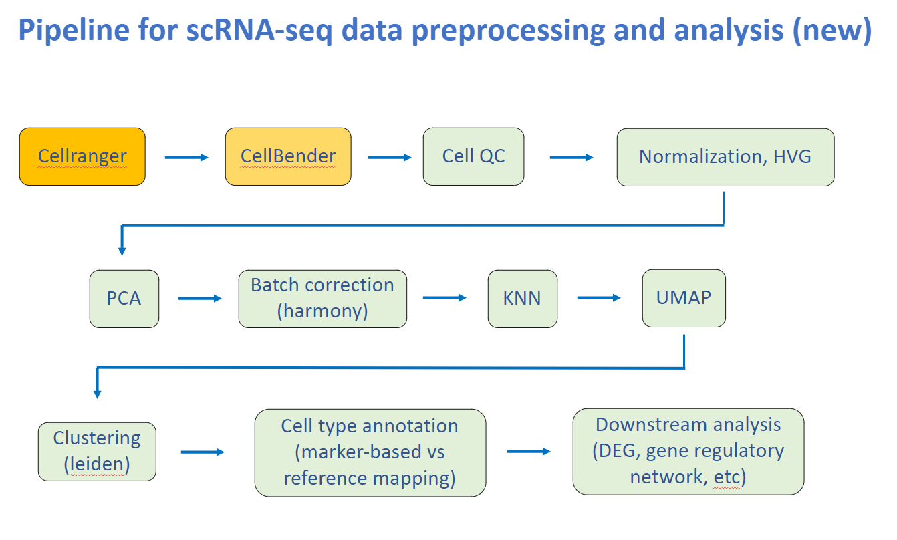
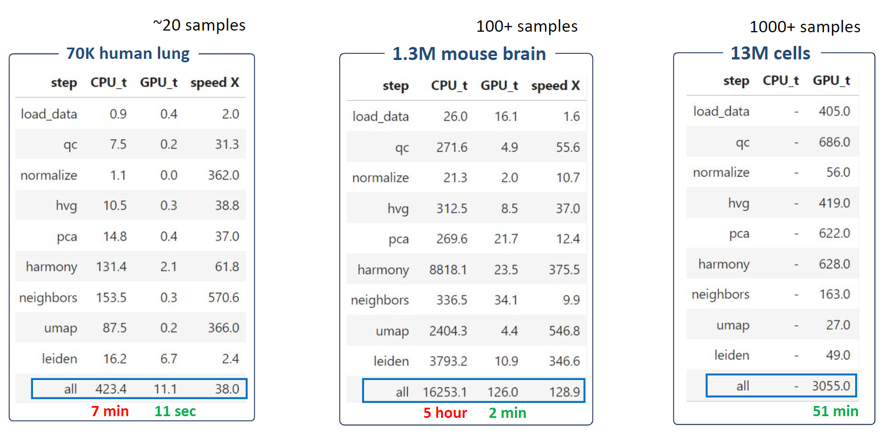

<!-- markdownlint-disable MD033 MD041 -->
<h1 align="center">
    ScaleSC
</h1>

<p align="center">
    <strong>A GPU-accelerated tool for large scale scRNA-seq pipeline.</strong>
</p>

<!-- <p align="center">
    <a href="https://pypi.org/project/lazydocs/" title="PyPi Version"></a>
    <a href="https://pypi.org/project/lazydocs/" title="Python Version"></a>
    <a href="https://www.codacy.com/gh/ml-tooling/lazydocs/dashboard" title="Codacy Analysis"></a>
    <a href="https://github.com/ml-tooling/lazydocs/actions?query=workflow%3Abuild-pipeline" title="Build status"></a>
    <a href="https://github.com/ml-tooling/lazydocs/blob/main/LICENSE" title="Project License"></a>
    <a href="https://gitter.im/ml-tooling/lazydocs" title="Chat on Gitter"></a>
    <a href="https://twitter.com/mltooling" title="ML Tooling on Twitter"></a>
</p> -->

<p align="center">
  <a href="#highlights">Highlights</a> •
  <a href="#why-scalesc">Why ScaleSC</a> •
  <a href="#how-to-install">Installation</a> •
  <a href="#api-reference">API Reference</a>
</p>

## Highlights

- Fast scRNA-seq pipeline including QC, Normalization, Batch-effect Removal, Dimension Reduction in a similar syntax as `scanpy` and `rapids-singlecell`.
- Scale to dataset with more than 10M cells. Chunk the data to avoid the `int32` limitation in `cupyx.scipy.sparse` used by `rapids-singlecell` that disables the computing for even moderate-size dataset (~1M).
- Reconcile output at each step to `scanpy` to reproduce the same results as on CPU end.
- Improvement on `harmonypy` which allows dataset with more than 10M cells and more than 1000 samples to be run on a single GPU (A100 80G).

## Why ScaleSC

<div align="center">

<b>ScaleSC Outline</b>



</div>

<br></br>

<div align="center">
<b>Overview of different packages*</b>

| | `scanpy` | `scalesc` | `rapids-singlecell` |
|:----------:|:----------:|:----------:|:----------:|
| GPU Support | ❌ | ✅ | ✅ |
| `int32` Issue in Sparse | ❌ | ❌ | ✅ |
| Upper Limit of #cell | ♾️ | **~20M** | ~1M |
| Upper Limit of #sample | ♾️ | **>1000** | <100 |

\* Test on datasets with ~35k genes. `scalesc` only support to run Harmony on a single GPU, this memory limitation greatly limits the capability of scaling to even larger dataset. However, there would be no limitation on number of cells if you prefer not to run Harmony (QC, HVG, and PCA only).  

</div>

<br></br>

<div align="center">

<b>Time comparsion between `scanpy`(CPU) and `scalesc`(GPU) on A100(80G)</b>



</div>

## How To Install
>#### Note: ScaleSC requires a **high-end GPU** and a matching **CUDA** version to support GPU-accelerated computing.
<div style="margin-left: 20px;">
 
Requirements:
>   - [**RAPIDS**](https://rapids.ai/) from Nvidia
>   - [**rapids-singlecell**](https://rapids-singlecell.readthedocs.io/en/latest/index.html), an alternative of *scanpy* that employs GPU for acceleration. 
>   - [**Conda**](https://docs.conda.io/projects/conda/en/latest/index.html), version >=22.11 is strongly encoruaged, because *conda-libmamba-solver* is set as default, which 
significant speeds up solving dependencies.  
>   - [**pip**](), a python package installer.

Environment Setup:
1. Install [**RAPIDS**](https://rapids.ai/) through Conda, \
    `conda create -n scalesc -c rapidsai -c conda-forge -c nvidia
    rapids=24.10 python=3.10 'cuda-version>=11.4,<=11.8'` \
    Users have flexibility to install it according to their systems by using this [online selector](https://docs.rapids.ai/install/?_gl=1*1em94gj*_ga*OTg5MDQyNDkyLjE3MjM0OTAyNjk.*_ga_RKXFW6CM42*MTczMDIxNzIzOS4yLjAuMTczMDIxNzIzOS42MC4wLjA.#selector).

2. Activate conda env, \
    `conda activate scalesc`
3. Install [**rapids-singlecell**](https://rapids-singlecell.readthedocs.io/en/latest/index.html) using pip, \
    `pip install rapids-singlecell` 

4. Install scaleSC,
    - pull scaleSC from github \
        `git clone https://github.com/interactivereport/scaleSC.git`
    - enter the folder and install scaleSC \
        `cd scaleSC` \
        `pip install .`
5. check env:
    - `python -c "import scalesc; print(scalesc.__version__)"` == 0.1.0
    - `python -c "import cupy; print(cupy.__version__)"` >= 13.3.0
    - `python -c "import cuml; print(cuml.__version__)"` >= 24.10
    - `python -c "import cupy; print(cupy.cuda.is_available())"` = True
    -  `python -c "import xgboost; print(xgboost.__version__)` >= 2.1.1, optionally for marker annotation

</div>

## Tutorial:
- See [this tutorial](./Tutorial_scaleSC.ipynb) for details.


## API Reference

<div style="margin-left: 20px;">

## <kbd>class</kbd> `ScaleSC`
ScaleSC integrated pipeline in a scanpy-like style. 

It will automatcially load dataset in chunks, see `scalesc.util.AnnDataBatchReader`  for details, and all methods in this class manipulate this chunked data. 


**Args:**
 


 - <b>`data_dir`</b> (`str`):  Data folder of the dataset. 
 - <b>`max_cell_batch`</b> (`int`):  Maximum number of cells in a single batch. 
 - <b>`Default`</b>:  100000. 
 - <b>`preload_on_cpu`</b> (`bool`):  If load the entire chunked data on CPU. Default: `True` 
 - <b>`preload_on_gpu`</b> (`bool`):  If load the entire chunked data on GPU, `preload_on_cpu`  
 - <b>`will be overwritten to `True` when this sets to `True`. Default`</b>:  `True`. 
 - <b>`save_raw_counts`</b> (`bool`):  If save `adata_X` to disk after QC filtering.  
 - <b>`Default`</b>:  False. 
 - <b>`save_norm_counts`</b> (`bool`):  If save `adata_X` data to disk after normalization.  
 - <b>`Default`</b>:  False. 
 - <b>`save_after_each_step`</b> (`bool`):  If save `adata` (without .X) to disk after each step.  
 - <b>`Default`</b>:  False. 
 - <b>`output_dir`</b> (`str`):  Output folder. Default: './results'. 
 - <b>`gpus`</b> (`list`):  List of GPU ids, `[0]` is set if this is None. Default: None. 

<a href="scalesc/pp.py#L37"></a>

### <kbd>method</kbd> `__init__`

```python
__init__(
    data_dir,
    max_cell_batch=100000.0,
    preload_on_cpu=True,
    preload_on_gpu=True,
    save_raw_counts=False,
    save_norm_counts=False,
    save_after_each_step=False,
    output_dir='results',
    gpus=None
)
```


---

#### <kbd>property</kbd> adata

`AnnData`: An AnnData object that used to store all intermediate results  without the count matrix.  

Note: This is always on CPU. 

---

#### <kbd>property</kbd> adata_X

`AnnData`: An `AnnData` object that used to store all intermediate results  including the count matrix. Internally, all chunks should be merged on CPU to avoid  high GPU consumption, make sure to invoke `to_CPU()` before calling this object. 


---

<a href="scalesc/pp.py#L100"></a>

### <kbd>method</kbd> `calculate_qc_metrics`

```python
calculate_qc_metrics()
```

Calculate quality control metrics. 

---

<a href="scalesc/pp.py#L87"></a>

### <kbd>method</kbd> `clear`

```python
clear()
```

Clean the memory 

---

<a href="scalesc/pp.py#L128"></a>

### <kbd>method</kbd> `filter_cells`

```python
filter_cells(min_count=0, max_count=None, qc_var='n_genes_by_counts', qc=False)
```

Filter genes based on number of a QC metric. 


**Args:**
 
 - <b>`min_count`</b> (`int`):  Minimum number of counts required for a cell to pass filtering. 
 - <b>`max_count`</b> (`int`):  Maximum number of counts required for a cell to pass filtering. 
 - <b>`qc_var`</b> (`str`='n_genes_by_counts'):  Feature in QC metrics that used to filter cells. 
 - <b>`qc`</b> (`bool`=`False`):  Call `calculate_qc_metrics` before filtering. 

---

<a href="scalesc/pp.py#L106"></a>

### <kbd>method</kbd> `filter_genes`

```python
filter_genes(min_count=0, max_count=None, qc_var='n_cells_by_counts', qc=False)
```

Filter genes based on number of a QC metric. 


**Args:**
 
 - <b>`min_count`</b> (`int`):  Minimum number of counts required for a gene to pass filtering. 
 - <b>`max_count`</b> (`int`):  Maximum number of counts required for a gene to pass filtering. 
 - <b>`qc_var`</b> (`str`='n_cells_by_counts'):  Feature in QC metrics that used to filter genes. 
 - <b>`qc`</b> (`bool`=`False`):  Call `calculate_qc_metrics` before filtering. 

---

<a href="scalesc/pp.py#L148"></a>

### <kbd>method</kbd> `filter_genes_and_cells`

```python
filter_genes_and_cells(
    min_counts_per_gene=0,
    min_counts_per_cell=0,
    max_counts_per_gene=None,
    max_counts_per_cell=None,
    qc_var_gene='n_cells_by_counts',
    qc_var_cell='n_genes_by_counts',
    qc=False
)
```

Filter genes based on number of a QC metric. 


**Note:**

> This is an efficient way to perform a regular filtering on genes and cells without repeatedly iterating over chunks. 
>

**Args:**
 
 - <b>`min_counts_per_gene`</b> (`int`):  Minimum number of counts required for a gene to pass filtering. 
 - <b>`max_counts_per_gene`</b> (`int`):  Maximum number of counts required for a gene to pass filtering. 
 - <b>`qc_var_gene`</b> (`str`='n_cells_by_counts'):  Feature in QC metrics that used to filter genes. 
 - <b>`min_counts_per_cell`</b> (`int`):  Minimum number of counts required for a cell to pass filtering. 
 - <b>`max_counts_per_cell`</b> (`int`):  Maximum number of counts required for a cell to pass filtering. 
 - <b>`qc_var_cell`</b> (`str`='n_genes_by_counts'):  Feature in QC metrics that used to filter cells. 
 - <b>`qc`</b> (`bool`=`False`):  Call `calculate_qc_metrics` before filtering. 

---

<a href="scalesc/pp.py#L351"></a>

### <kbd>method</kbd> `harmony`

```python
harmony(sample_col_name, n_init=10, max_iter_harmony=20)
```

Use Harmony to integrate different experiments. 


**Note:**

> This modified harmony function can easily scale up to 15M cells with 50 pcs on GPU (A100 80G). Result after harmony is stored into `adata.obsm['X_pca_harmony']`. 
>

**Args:**
 
 - <b>`sample_col_name`</b> (`str`):  Column of sample ID. 
 - <b>`n_init`</b> (`int`=`10`):  Number of times the k-means algorithm is run with different centroid seeds. 
 - <b>`max_iter_harmony`</b> (`int`=`20`):  Maximum iteration number of harmony. 

---

<a href="scalesc/pp.py#L186"></a>

### <kbd>method</kbd> `highly_variable_genes`

```python
highly_variable_genes(n_top_genes=4000, method='seurat_v3')
```

Annotate highly variable genes. 


**Note:**

> Only `seurat_v3` is implemented. Count data is expected for `seurat_v3`. HVGs are set to `True` in `adata.var['highly_variable']`. 
>

**Args:**
 
 - <b>`n_top_genes`</b> (`int`=`4000`):  Number of highly-variable genes to keep. 
 - <b>`method`</b> (`str`=`'seurat_v3'`):  Choose the flavor for identifying highly variable genes. 

---

<a href="scalesc/pp.py#L381"></a>

### <kbd>method</kbd> `leiden`

```python
leiden(resolution=0.5, random_state=42)
```

Performs Leiden clustering using `rapids-singlecell`. 


**Args:**
 
 - <b>`resolution`</b> (`float`=`0.5`):  A parameter value controlling the coarseness of the clustering.  (called gamma in the modularity formula). Higher values lead to more clusters. 
 - <b>`random_state`</b> (`int`=`42`):  Random seed. 

---

<a href="scalesc/pp.py#L367"></a>

### <kbd>method</kbd> `neighbors`

```python
neighbors(n_neighbors=20, n_pcs=50, use_rep='X_pac_harmony', algorithm='cagra')
```

Compute a neighborhood graph of observations using `rapids-singlecell`. 


**Args:**
 
 - <b>`n_neighbors`</b> (`int`=`20`):  The size of local neighborhood (in terms of number of neighboring data points)  used for manifold approximation. 
 - <b>`n_pcs`</b> (`int`=`50`):  Use this many PCs. 
 - <b>`use_rep`</b> (`str`=`'X_pca_harmony'`):  Use the indicated representation. 
 - <b>`algorithm`</b> (`str`=`'cagra'`):  The query algorithm to use. 

---

<a href="scalesc/pp.py#L245"></a>

### <kbd>method</kbd> `normalize_log1p`

```python
normalize_log1p(target_sum=10000.0)
```

Normalize counts per cell then log1p. 


**Note:**

> If `save_raw_counts` or `save_norm_counts` is set, write `adata_X` to disk here automatically. 
>

**Args:**
 
 - <b>`target_sum`</b> (`int`=`1e4`):  If None, after normalization, each observation (cell) has a total count  equal to the median of total counts for observations (cells) before normalization. 

---

<a href="scalesc/pp.py#L307"></a>

### <kbd>method</kbd> `normalize_log1p_pca`

```python
normalize_log1p_pca(
    target_sum=10000.0,
    n_components=50,
    hvg_var='highly_variable'
)
```

An alternative for calling `normalize_log1p` and `pca` together.   


**Note:**

> Used when `preload_on_cpu` is `False`. 

---

<a href="scalesc/pp.py#L265"></a>

### <kbd>method</kbd> `pca`

```python
pca(n_components=50, hvg_var='highly_variable')
```

Principal component analysis. 

Computes PCA coordinates, loadings and variance decomposition. Uses the implementation of scikit-learn. 


**Note:**

> Flip the directions according to the largest values in loadings. Results will match up with scanpy perfectly. Calculated PCA matrix is stored in `adata.obsm['X_pca']`. 
>

**Args:**
 
 - <b>`n_components`</b> (`int`=`50`):  Number of principal components to compute. 
 - <b>`hvg_var`</b> (`str`=`'highly_variable'`):  Use highly variable genes only. 

---

<a href="scalesc/pp.py#L404"></a>

### <kbd>method</kbd> `save`

```python
save(data_name=None)
```

Save `adata` to disk. 


**Note:**

> Save to '`output_dir`/`data_name`.h5ad'. 
>

**Args:**
 
 - <b>`data_name`</b> (`str`):  If `None`, set as `data_dir`. 

---

<a href="scalesc/pp.py#L417"></a>

### <kbd>method</kbd> `savex`

```python
savex(name, data_name=None)
```

Save `adata` to disk in chunks. 


**Note:**

> Each chunk will be saved individually in a subfolder under `output_dir`. Save to '`output_dir`/`name`/`data_name`_`i`.h5ad'. 
>

**Args:**
 
 - <b>`name`</b> (`str`):  Subfolder name.  
 - <b>`data_name`</b> (`str`):  If `None`, set as `data_dir`. 

---

<a href="scalesc/pp.py#L83"></a>

### <kbd>method</kbd> `to_CPU`

```python
to_CPU()
```

Move all chunks to CPU. 

---

<a href="scalesc/pp.py#L79"></a>

### <kbd>method</kbd> `to_GPU`

```python
to_GPU()
```

Move all chunks to GPU. 

---

<a href="scalesc/pp.py#L394"></a>

### <kbd>method</kbd> `umap`

```python
umap(random_state=42)
```

Embed the neighborhood graph using `rapids-singlecell`. 


**Args:**
 
 - <b>`random_state`</b> (`int`=`42`):  Random seed. 


---

<a href="scalesc/util.py#L30"></a>

## <kbd>class</kbd> `AnnDataBatchReader`
Chunked dataloader for extremely large single-cell dataset. Return a data chunk each time for further processing. 

<a href="scalesc/util.py#L32"></a>

### <kbd>method</kbd> `__init__`

```python
__init__(
    data_dir,
    preload_on_cpu=True,
    preload_on_gpu=False,
    gpus=None,
    max_cell_batch=100000,
    max_gpu_memory_usage=48.0,
    return_anndata=True
)
```


---

#### <kbd>property</kbd> shape


---

<a href="scalesc/util.py#L84"></a>

### <kbd>method</kbd> `batch_to_CPU`

```python
batch_to_CPU()
```


---

<a href="scalesc/util.py#L89"></a>

### <kbd>method</kbd> `batch_to_GPU`

```python
batch_to_GPU()
```


---

<a href="scalesc/util.py#L281"></a>

### <kbd>method</kbd> `batchify`

```python
batchify(axis='cell')
```

Return a data generator if `preload_on_cpu` is set as `True`.  

---

<a href="scalesc/util.py#L75"></a>

### <kbd>method</kbd> `clear`

```python
clear()
```


---

<a href="scalesc/util.py#L94"></a>

### <kbd>method</kbd> `get_merged_adata_with_X`

```python
get_merged_adata_with_X()
```


---

<a href="scalesc/util.py#L205"></a>

### <kbd>method</kbd> `gpu_wrapper`

```python
gpu_wrapper(generator)
```


---

<a href="scalesc/util.py#L210"></a>

### <kbd>method</kbd> `read`

```python
read(fname)
```


---

<a href="scalesc/util.py#L129"></a>

### <kbd>method</kbd> `set_cells_filter`

```python
set_cells_filter(filter, update=True)
```

Update cells filter and applied on data chunks if `update` set to `True`, otherwise, update filter only. 

---

<a href="scalesc/util.py#L155"></a>

### <kbd>method</kbd> `set_genes_filter`

```python
set_genes_filter(filter, update=True)
```

Update genes filter and applied on data chunks if `update` set to True, otherwise, update filter only.  


**Note:**

> Genes filter can be set sequentially, a new filter should be always compatible with the previous filtered data. 

---

<a href="scalesc/util.py#L191"></a>

### <kbd>method</kbd> `update_by_cells_filter`

```python
update_by_cells_filter(filter)
```


---

<a href="scalesc/util.py#L198"></a>

### <kbd>method</kbd> `update_by_genes_filter`

```python
update_by_genes_filter(filter)
```


---

_This file was automatically generated via [lazydocs](https://github.com/ml-tooling/lazydocs)._

</div>


## Contact
- [@haotianzh](mailto:johndoe@fakeemail.com)

    